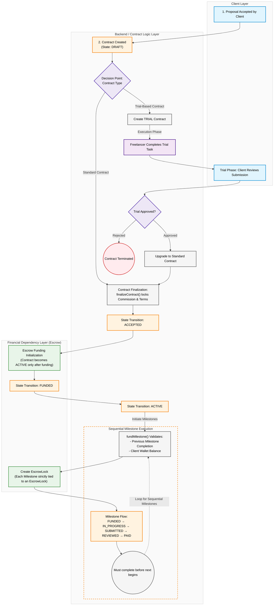

```mermaid
flowchart TD
    %% Component Styles
    classDef client fill:#e1f5fe,stroke:#0288d1,stroke-width:2px,color:#000
    classDef backend fill:#f5f5f5,stroke:#616161,stroke-width:2px,color:#000
    classDef financial fill:#e8f5e9,stroke:#388e3c,stroke-width:2px,color:#000
    classDef decision fill:#ede7f6,stroke:#512da8,stroke-width:2px,color:#000
    classDef contractState fill:#fff3e0,stroke:#f57c00,stroke-width:2px,color:#000
    classDef terminal fill:#ffebee,stroke:#d32f2f,stroke-width:2px,color:#000
    classDef freelancer fill:#f3e5f5,stroke:#4a148c,stroke-width:2px,color:#000

    subgraph ClientLayer ["Client Layer"]
        A["1. Proposal Accepted by Client"]:::client
        F["Trial Phase: Client Reviews Submission"]:::client
    end

    subgraph BackendLayer ["Backend / Contract Logic Layer"]
        B["2. Contract Created<br/>(State: DRAFT)"]:::contractState
        C{"Decision Point:<br/>Contract Type"}:::decision
        
        %% Trial Logic
        D["Create TRIAL Contract"]:::backend
        E["Freelancer Completes Trial Task"]:::freelancer
        G{"Trial Approved?"}:::decision
        H["Upgrade to Standard Contract"]:::backend
        I(("Contract Terminated")):::terminal
        
        %% Finalization Logic
        J["Contract Finalization:<br/>finalizeContract() locks Commission & Terms"]:::backend
        K["State Transition: ACCEPTED"]:::contractState
        L["State Transition: ACTIVE"]:::contractState

        %% Milestone workflow
        subgraph MilestoneWorkflow ["Sequential Milestone Execution"]
            direction TB
            O["fundMilestone() Validates:<br/>- Previous Milestone Completion<br/>- Client Wallet Balance"]:::backend
            P["Milestone Flow:<br/>FUNDED → IN_PROGRESS → SUBMITTED → REVIEWED → PAID"]:::contractState
            Q(("Must complete before next begins")):::backend
        end
    end

    subgraph FinancialLayer ["Financial Dependency Layer (Escrow)"]
        M["Escrow Funding Initialization<br/>(Contract becomes ACTIVE only after funding)"]:::financial
        N["State Transition: FUNDED"]:::contractState
        R["Create EscrowLock<br/>(Each Milestone strictly tied to an EscrowLock)"]:::financial
    end

    %% Flow connections
    A --> B
    B --> C
    
    %% Branch Trial
    C -- "Trial-Based Contract" --> D
    D -->|"Execution Phase"| E
    E --> F
    F --> G
    
    G -- "Approved" --> H
    G -- "Rejected" --> I
    
    %% Branch Standard + Join
    C -- "Standard Contract" --> J
    H --> J
    
    J --> K
    K --> M
    M --> N
    N --> L
    
    L -->|"Initiate Milestones"| O
    O --> R
    R --> P
    P --> Q
    Q -.->|"Loop for Sequential Milestones"| O
    
    %% Subgraph styling
    style ClientLayer fill:#fafafa,stroke:#cccccc,stroke-width:1px
    style BackendLayer fill:#fafafa,stroke:#cccccc,stroke-width:1px
    style FinancialLayer fill:#fafafa,stroke:#cccccc,stroke-width:1px
    style MilestoneWorkflow fill:transparent,stroke:#f57c00,stroke-width:2px,stroke-dasharray: 5 5
```
