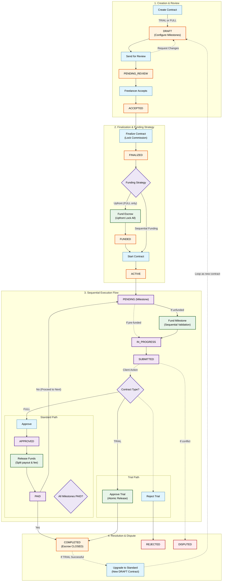

```mermaid
flowchart TD
    %% Core Component Styles
    classDef contract fill:#fff3e0,stroke:#e65100,stroke-width:2px,color:#000
    classDef milestone fill:#f3e5f5,stroke:#4a148c,stroke-width:2px,color:#000
    classDef actionNode fill:#e1f5fe,stroke:#01579b,stroke-width:1px,color:#000
    classDef financial fill:#e8f5e9,stroke:#1b5e20,stroke-width:2px,color:#000
    classDef decision fill:#ede7f6,stroke:#512da8,stroke-width:2px,color:#000
    classDef terminal fill:#ffebee,stroke:#b71c1c,stroke-width:2px,color:#000

    subgraph Phase1 ["1. Creation & Review"]
        A["Create Contract"]:::actionNode
        B["DRAFT<br/>(Configure Milestones)"]:::contract
        C["Send for Review"]:::actionNode
        D["PENDING_REVIEW"]:::contract
        E["Freelancer Accepts"]:::actionNode
        F["ACCEPTED"]:::contract
    end

    subgraph Phase2 ["2. Finalization & Funding Strategy"]
        G["Finalize Contract<br/>(Lock Commission)"]:::actionNode
        H["FINALIZED"]:::contract
        
        I{"Funding Strategy"}:::decision
        
        J1["Fund Escrow<br/>(Upfront Lock All)"]:::financial
        K1["FUNDED"]:::contract
        
        L["Start Contract"]:::actionNode
        M["ACTIVE"]:::contract
    end

    subgraph Phase3 ["3. Sequential Execution Flow"]
        direction TB
        N1["PENDING (Milestone)"]:::milestone
        
        N2["Fund Milestone<br/>(Sequential Validation)"]:::financial
        
        O["IN_PROGRESS"]:::milestone
        P["SUBMITTED"]:::milestone
        
        Q{"Contract Type?"}:::decision
        
        %% Standard Contract Path
        subgraph StandardPath ["Standard Path"]
            R1["Approve"]:::actionNode
            R2["APPROVED"]:::milestone
            R3["Release Funds<br/>(Split payout & fee)"]:::financial
            R4["PAID"]:::milestone
            R5{"All Milestones PAID?"}:::decision
        end
        
        %% Trial Path
        subgraph TrialPath ["Trial Path"]
            T1["Approve Trial<br/>(Atomic Release)"]:::financial
            T2["Reject Trial"]:::actionNode
        end
    end

    subgraph Phase4 ["4. Resolution & Dispute"]
        Comp["COMPLETED<br/>(Escrow CLOSED)"]:::contract
        Upg["Upgrade to Standard<br/>(New DRAFT Contract)"]:::actionNode
        Rej["REJECTED"]:::terminal
        Dis["DISPUTED"]:::terminal
    end

    %% Wiring: Creation
    A -->|"TRIAL or FULL"| B
    B --> C
    C -.->|"Request Changes"| B
    C --> D
    D --> E
    E --> F
    F --> G
    G --> H
    
    %% Wiring: Activation
    H --> I
    I -- "Upfront (FULL only)" --> J1
    J1 --> K1
    K1 --> L
    
    I -- "Sequential Funding" --> L
    
    L --> M
    M --> N1
    
    %% Wiring: Execution Flow
    N1 -->|"If unfunded"| N2
    N1 -.->|"If pre-funded"| O
    N2 --> O
    O --> P
    
    P -.->|"Client Action"| Q
    P -.->|"If conflict"| Dis
    
    %% Standard Path Execution
    Q -- "FULL" --> R1
    R1 --> R2
    R2 --> R3
    R3 --> R4
    R4 -- "No (Proceed to Next)" --> N1
    R4 -- "Yes" --> Comp
    
    %% Trial Path Execution
    Q -- "TRIAL" --> T1
    Q -.-> T2
    T2 --> Rej
    T1 --> Comp
    
    Comp -.->|"If TRIAL Successful"| Upg
    Upg -.->|"Loop as new contract"| B
```
