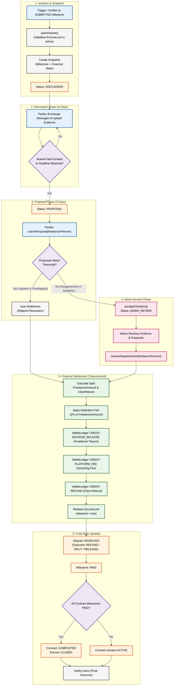

```mermaid
flowchart TD
    %% Core Styling
    classDef client fill:#e3f2fd,stroke:#0d47a1,stroke-width:2px,color:#000
    classDef system fill:#f5f5f5,stroke:#424242,stroke-width:2px,color:#000
    classDef admin fill:#fce4ec,stroke:#c2185b,stroke-width:2px,color:#000
    classDef financial fill:#e8f5e9,stroke:#1b5e20,stroke-width:2px,color:#000
    classDef decision fill:#ede7f6,stroke:#512da8,stroke-width:2px,color:#000
    classDef terminal fill:#fff3e0,stroke:#e65100,stroke-width:2px,color:#000

    subgraph Phase1 ["1. Initiation & Snapshot"]
        A["Trigger: Conflict on SUBMITTED Milestone"]:::client
        B["openDispute()<br/>(Validates EscrowLock is active)"]:::system
        C["Create Snapshot<br/>(Milestone + Financial State)"]:::system
        D["Status: DISCUSSION"]:::terminal
    end

    subgraph Phase2 ["2. Discussion Phase (5 Days)"]
        E["Parties Exchange Messages & Upload Evidence"]:::client
        F{"Mutual Fast-Forward<br/>or Deadline Reached?"}:::decision
    end

    subgraph Phase3 ["3. Proposal Phase (3 Days)"]
        G["Status: PROPOSAL"]:::terminal
        H["Parties submitProposal(freelancerPercent)"]:::client
        I{"Proposals Match<br/>Threshold?"}:::decision
        J["Auto Settlement<br/>(Midpoint Resolution)"]:::system
    end

    subgraph Phase4 ["4. Admin Review Phase"]
        K["escalateToAdmin()<br/>Status: ADMIN_REVIEW"]:::admin
        L["Admin Reviews Evidence & Proposals"]:::admin
        M["resolveDisputeAdmin(freelancerPercent)"]:::admin
    end

    subgraph Phase5 ["5. Financial Settlement (Transactional)"]
        direction TB
        N1["Calculate Split:<br/>FreelancerAmount & ClientRefund"]:::financial
        N2["Apply Arbitration Fee:<br/>(2% of FreelancerAmount)"]:::financial
        N3["WalletLedger CREDIT:<br/>ESCROW_RELEASE (Freelancer Payout)"]:::financial
        N4["WalletLedger CREDIT:<br/>PLATFORM_FEE (SmartGig Fee)"]:::financial
        N5["WalletLedger CREDIT:<br/>REFUND (Client Refund)"]:::financial
        N6["Release EscrowLock<br/>(released = true)"]:::financial
    end

    subgraph Phase6 ["6. Final State Updates"]
        O["Dispute: RESOLVED<br/>(Outcome: REFUND / SPLIT / RELEASE)"]:::terminal
        P["Milestone: PAID"]:::terminal
        Q{"All Contract Milestones PAID?"}:::decision
        R["Contract: COMPLETED<br/>Escrow: CLOSED"]:::terminal
        S["Contract remains ACTIVE"]:::terminal
        T["Notify Users (Final Outcome)"]:::system
    end

    %% Wiring
    A --> B
    B --> C
    C --> D
    
    D --> E
    E --> F
    F -- "No" --> E
    F -- "Yes" --> G
    
    G --> H
    H --> I
    I -- "Yes (Agreed or Overlapped)" --> J
    I -- "No (Disagreement or Deadline)" --> K
    
    J --> N1
    
    K --> L
    L --> M
    M --> N1
    
    N1 --> N2
    N2 --> N3
    N3 --> N4
    N4 --> N5
    N5 --> N6
    
    N6 --> O
    O --> P
    P --> Q
    
    Q -- "Yes" --> R
    Q -- "No" --> S
    
    R --> T
    S --> T
```
