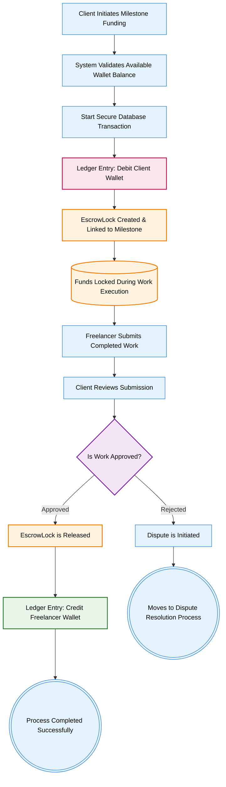

```mermaid
flowchart TD
    %% Component Styles
    classDef clientWallet fill:#fce4ec,stroke:#c2185b,stroke-width:2px,color:#000
    classDef escrowLock fill:#fff3e0,stroke:#f57c00,stroke-width:2px,color:#000
    classDef freelancerWallet fill:#e8f5e9,stroke:#2e7d32,stroke-width:2px,color:#000
    classDef system fill:#e3f2fd,stroke:#1976d2,stroke-width:1px,color:#000
    classDef decision fill:#f3e5f5,stroke:#7b1fa2,stroke-width:2px,color:#000

    A[Client Initiates Milestone Funding]:::system
    B[System Validates Available Wallet Balance]:::system
    C[Start Secure Database Transaction]:::system
    D[Ledger Entry: Debit Client Wallet]:::clientWallet
    E[EscrowLock Created & Linked to Milestone]:::escrowLock
    F[(Funds Locked During Work Execution)]:::escrowLock
    G[Freelancer Submits Completed Work]:::system
    H[Client Reviews Submission]:::system
    I{Is Work Approved?}:::decision
    J[EscrowLock is Released]:::escrowLock
    K[Ledger Entry: Credit Freelancer Wallet]:::freelancerWallet
    L(((Process Completed Successfully))):::system
    M[Dispute is Initiated]:::system
    N(((Moves to Dispute Resolution Process))):::system

    %% Flow
    A --> B
    B --> C
    C --> D
    D --> E
    E --> F
    F --> G
    G --> H
    H --> I

    %% Approved Path
    I -- Approved --> J
    J --> K
    K --> L

    %% Rejected Path
    I -- Rejected --> M
    M --> N
```
