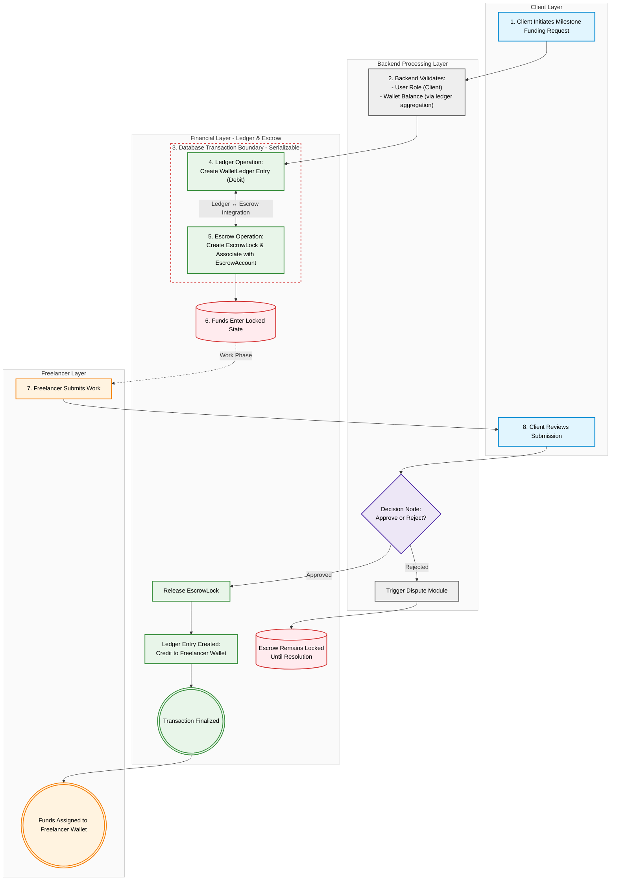

```mermaid
flowchart TD
    %% Base Styles
    classDef default font-family:sans-serif;
    classDef client fill:#e1f5fe,stroke:#0288d1,stroke-width:2px,color:#000
    classDef backend fill:#eeeeee,stroke:#616161,stroke-width:2px,color:#000
    classDef financial fill:#e8f5e9,stroke:#388e3c,stroke-width:2px,color:#000
    classDef escrowState fill:#ffebee,stroke:#d32f2f,stroke-width:2px,color:#000
    classDef freelancer fill:#fff3e0,stroke:#f57c00,stroke-width:2px,color:#000
    classDef decision fill:#ede7f6,stroke:#512da8,stroke-width:2px,color:#000
    
    subgraph ClientLayer ["Client Layer"]
        A["1. Client Initiates Milestone Funding Request"]:::client
        H["8. Client Reviews Submission"]:::client
    end

    subgraph BackendLayer ["Backend Processing Layer"]
        B["2. Backend Validates:<br/>- User Role (Client)<br/>- Wallet Balance (via ledger aggregation)"]:::backend
        I{"Decision Node:<br/>Approve or Reject?"}:::decision
        M["Trigger Dispute Module"]:::backend
    end

    subgraph FinancialLayer ["Financial Layer - Ledger & Escrow"]
        subgraph DBTransaction ["3. Database Transaction Boundary - Serializable"]
            D["4. Ledger Operation:<br/>Create WalletLedger Entry (Debit)"]:::financial
            E["5. Escrow Operation:<br/>Create EscrowLock & Associate with EscrowAccount"]:::financial
            D <-->|"Ledger ↔ Escrow Integration"| E
        end
        
        F[("6. Funds Enter Locked State")]:::escrowState
        
        J["Release EscrowLock"]:::financial
        K["Ledger Entry Created:<br/>Credit to Freelancer Wallet"]:::financial
        L((("Transaction Finalized"))):::financial
        
        N[("Escrow Remains Locked<br/>Until Resolution")]:::escrowState
    end

    subgraph FreelancerLayer ["Freelancer Layer"]
        G["7. Freelancer Submits Work"]:::freelancer
        O((("Funds Assigned to Freelancer Wallet"))):::freelancer
    end

    %% Sequential Data Flow
    A --> B
    B --> D
    E --> F
    
    F -.->|"Work Phase"| G
    G --> H
    H --> I
    
    I -- "Approved" --> J
    J --> K
    K --> L
    L --> O
    
    I -- "Rejected" --> M
    M --> N
    
    %% Styles for subgraphs
    style DBTransaction fill:transparent,stroke:#d32f2f,stroke-width:2px,stroke-dasharray: 5 5
    style ClientLayer fill:#fafafa,stroke:#cccccc,stroke-width:1px
    style BackendLayer fill:#fafafa,stroke:#cccccc,stroke-width:1px
    style FinancialLayer fill:#fafafa,stroke:#cccccc,stroke-width:1px
    style FreelancerLayer fill:#fafafa,stroke:#cccccc,stroke-width:1px
```
