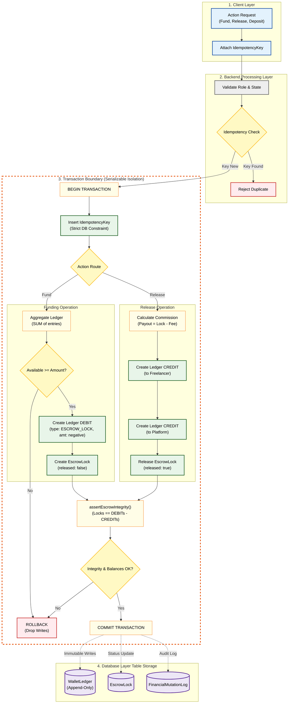

```mermaid
flowchart TD
    %% Core Styling
    classDef client fill:#e3f2fd,stroke:#0d47a1,stroke-width:2px,color:#000
    classDef preCheck fill:#eeeeee,stroke:#616161,stroke-width:2px,color:#000
    classDef txNode fill:#fffde7,stroke:#f57f17,stroke-width:1px,color:#000
    classDef decision fill:#fff9c4,stroke:#fbc02d,stroke-width:2px,color:#000
    classDef write fill:#e8f5e9,stroke:#1b5e20,stroke-width:2px,color:#000
    classDef db fill:#ede7f6,stroke:#4a148c,stroke-width:2px,color:#000
    classDef rollback fill:#ffebee,stroke:#c62828,stroke-width:2px,color:#000

    subgraph Layer1 ["1. Client Layer"]
        A["Action Request<br/>(Fund, Release, Deposit)"]:::client
        A_Idem["Attach IdempotencyKey"]:::client
    end

    subgraph Layer2 ["2. Backend Processing Layer"]
        Val["Validate Role & State"]:::preCheck
        B{"Idempotency Check"}:::decision
        R_Dup["Reject Duplicate"]:::rollback
    end

    subgraph Layer3 ["3. Transaction Boundary (Serializable Isolation)"]
        TX["BEGIN TRANSACTION"]:::txNode
        
        T1["Insert IdempotencyKey<br/>(Strict DB Constraint)"]:::write
        
        T2{"Action Route"}:::decision
        
        %% Funding Flow
        subgraph BranchFunding ["Funding Operation"]
            F1["Aggregate Ledger<br/>(SUM of entries)"]:::txNode
            F2{"Available >= Amount?"}:::decision
            F3["Create Ledger DEBIT<br/>(type: ESCROW_LOCK, amt: negative)"]:::write
            F4["Create EscrowLock<br/>(released: false)"]:::write
        end
        
        %% Release Flow
        subgraph BranchRelease ["Release Operation"]
            R1["Calculate Commission<br/>(Payout = Lock - Fee)"]:::txNode
            R2["Create Ledger CREDIT<br/>(to Freelancer)"]:::write
            R3["Create Ledger CREDIT<br/>(to Platform)"]:::write
            R4["Release EscrowLock<br/>(released: true)"]:::write
        end
        
        %% Integrity and Commit
        I1["assertEscrowIntegrity()<br/>(Locks == DEBITs - CREDITs)"]:::txNode
        I2{"Integrity & Balances OK?"}:::decision
        R_Fail["ROLLBACK<br/>(Drop Writes)"]:::rollback
        
        TX_Commit["COMMIT TRANSACTION"]:::txNode
    end

    subgraph Layer4 ["4. Database Layer Table Storage"]
        DB_Ledger[("WalletLedger<br/>(Append-Only)")]:::db
        DB_Locks[("EscrowLock")]:::db
        DB_Log[("FinancialMutationLog")]:::db
    end

    %% Wiring: Client to Backend
    A --> A_Idem
    A_Idem --> Val
    Val --> B
    B -- "Key Found" --> R_Dup
    B -- "Key New" --> TX
    
    %% Wiring: Transaction Start
    TX --> T1
    T1 --> T2
    
    %% Wiring: Funding Branch
    T2 -- "Fund" --> F1
    F1 --> F2
    F2 -- "No" --> R_Fail
    F2 -- "Yes" --> F3
    F3 --> F4
    F4 --> I1
    
    %% Wiring: Release Branch
    T2 -- "Release" --> R1
    R1 --> R2
    R2 --> R3
    R3 --> R4
    R4 --> I1
    
    %% Wiring: Integrity
    I1 --> I2
    I2 -- "No" --> R_Fail
    I2 -- "Yes" --> TX_Commit
    
    %% Wiring: Database Commits
    TX_Commit -.->|"Immutable Writes"| DB_Ledger
    TX_Commit -.->|"Status Update"| DB_Locks
    TX_Commit -.->|"Audit Log"| DB_Log
    
    %% Styling the Transaction Boundary
    style Layer3 fill:transparent,stroke:#e65100,stroke-width:3px,stroke-dasharray: 6 6
```
