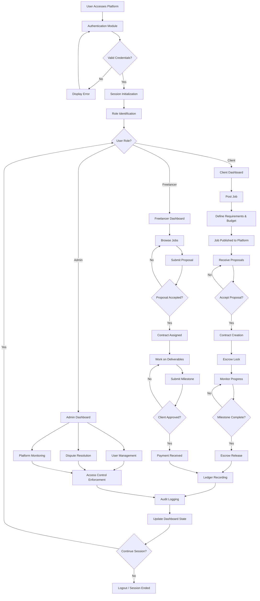

# Proposed Methodology – System Workflow

```mermaid
flowchart TD
    A[User Accesses Platform] --> B[Authentication Module]
    B --> C{Valid Credentials?}
    C -->|No| D[Display Error]
    D --> B
    C -->|Yes| E[Session Initialization]
    E --> F[Role Identification]
    F --> G{User Role?}
    
    G -->|Client| H[Client Dashboard]
    G -->|Freelancer| I[Freelancer Dashboard]
    G -->|Admin| J[Admin Dashboard]
    
    %% Client Flow
    H --> K[Post Job]
    K --> L[Define Requirements & Budget]
    L --> M[Job Published to Platform]
    M --> N[Receive Proposals]
    N --> O{Accept Proposal?}
    O -->|No| N
    O -->|Yes| P[Contract Creation]
    P --> Q[Escrow Lock]
    Q --> R[Monitor Progress]
    R --> S{Milestone Complete?}
    S -->|No| R
    S -->|Yes| T[Escrow Release]
    T --> U[Ledger Recording]
    
    %% Freelancer Flow
    I --> V[Browse Jobs]
    V --> W[Submit Proposal]
    W --> X{Proposal Accepted?}
    X -->|No| V
    X -->|Yes| Y[Contract Assigned]
    Y --> Z[Work on Deliverables]
    Z --> AA[Submit Milestone]
    AA --> AB{Client Approved?}
    AB -->|No| Z
    AB -->|Yes| AC[Payment Received]
    AC --> U
    
    %% Admin Flow
    J --> AD[User Management]
    J --> AE[Dispute Resolution]
    J --> AF[Platform Monitoring]
    AD --> AG[Access Control Enforcement]
    AE --> AG
    AF --> AG
    
    %% Common Services
    U --> AH[Audit Logging]
    AG --> AH
    AH --> AI[Update Dashboard State]
    
    AI --> AJ{Continue Session?}
    AJ -->|Yes| G
    AJ -->|No| AK[Logout / Session Ended]
```
