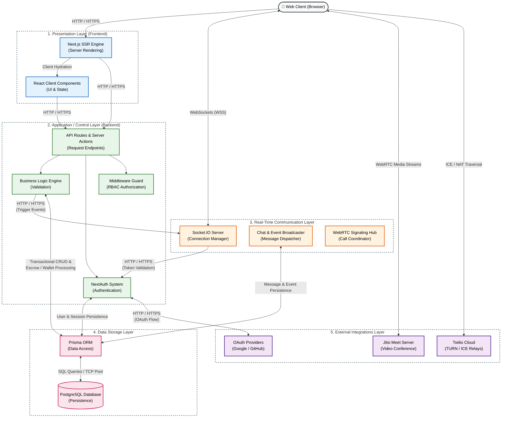

# **SmartGig – System Architecture Diagram**

```mermaid
flowchart TD
    %% Styling Definitions
    classDef layerBox fill:transparent,stroke:#546E7A,stroke-width:2px,stroke-dasharray: 4 4;
    classDef front fill:#E3F2FD,stroke:#1565C0,stroke-width:2px,color:#000;
    classDef back fill:#E8F5E9,stroke:#2E7D32,stroke-width:2px,color:#000;
    classDef real fill:#FFF3E0,stroke:#E65100,stroke-width:2px,color:#000;
    classDef data fill:#FCE4EC,stroke:#C2185B,stroke-width:2px,color:#000;
    classDef ext fill:#F3E5F5,stroke:#4A148C,stroke-width:2px,color:#000;
    classDef client fill:#FAFAFA,stroke:#263238,stroke-width:2px,color:#000;

    Client(["👤 Web Client (Browser)"]):::client

    %% 1. Presentation Layer
    subgraph Layer1 ["1. Presentation Layer (Frontend)"]
        SSR["Next.js SSR Engine\n(Server Rendering)"]:::front
        UI["React Client Components\n(UI & State)"]:::front
    end

    %% 2. Application Layer
    subgraph Layer2 ["2. Application / Control Layer (Backend)"]
        API["API Routes & Server Actions\n(Request Endpoints)"]:::back
        RBAC["Middleware Guard\n(RBAC Authorization)"]:::back
        Auth["NextAuth System\n(Authentication)"]:::back
        Logic["Business Logic Engine\n(Validation)"]:::back
    end

    %% 3. Real-Time Layer
    subgraph Layer3 ["3. Real-Time Communication Layer"]
        SocketIO["Socket.IO Server\n(Connection Manager)"]:::real
        ChatEngine["Chat & Event Broadcaster\n(Message Dispatcher)"]:::real
        Signaling["WebRTC Signaling Hub\n(Call Coordinator)"]:::real
    end

    %% 4. Data Layer
    subgraph Layer4 ["4. Data Storage Layer"]
        ORM["Prisma ORM\n(Data Access)"]:::data
        Database[("PostgreSQL Database\n(Persistence)")]:::data
    end

    %% 5. External Services
    subgraph Layer5 ["5. External Integrations Layer"]
        OAuthProviders["OAuth Providers\n(Google / GitHub)"]:::ext
        JitsiMeet["Jitsi Meet Server\n(Video Conference)"]:::ext
        TwilioTurn["Twilio Cloud\n(TURN / ICE Relays)"]:::ext
    end

    %% --- Interaction Flows ---

    %% Client Interactions
    Client -->|"HTTP / HTTPS"| SSR
    Client <-->|"WebSockets (WSS)"| SocketIO
    Client <-->|"WebRTC Media Streams"| JitsiMeet
    Client -->|"ICE / NAT Traversal"| TwilioTurn

    %% Layer 1 Internal & Outbound
    SSR -->|"Client Hydration"| UI
    SSR -->|"HTTP / HTTPS"| API
    UI -->|"HTTP / HTTPS"| API

    %% Layer 2 Internal
    API --> Logic
    API --> Auth
    API --> RBAC

    %% Layer 2 to Layer 3
    Logic -->|"HTTP / HTTPS\n(Trigger Events)"| SocketIO
    SocketIO -->|"HTTP / HTTPS\n(Token Validation)"| Auth

    %% To Layer 4 (Data)
    Logic <-->|"Transactional CRUD &\nEscrow / Wallet Processing"| ORM
    Auth <-->|"User & Session Persistence"| ORM
    ChatEngine <-->|"Message & Event Persistence"| ORM

    %% Layer 4 Internal
    ORM <-->|"SQL Queries / TCP Pool"| Database

    %% External Services Integration
    Auth <-->|"HTTP / HTTPS\n(OAuth Flow)"| OAuthProviders

    class Layer1,Layer2,Layer3,Layer4,Layer5 layerBox;
```
